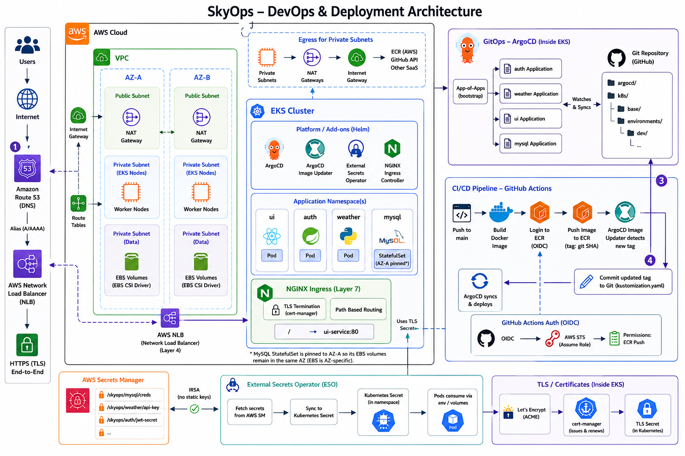

# ☁️ SkyOps

> A production-grade, cloud-native weather platform deployed on AWS EKS using a GitOps workflow.

SkyOps is a cloud-native weather application built with a microservices architecture. It provides user authentication and real-time weather information through a modern web interface while showcasing production-grade DevOps practices including Kubernetes, GitOps, CI/CD automation, Infrastructure as Code, and secure secrets management on AWS.

**Live (dev):** [https://skyops.fortstak.online](https://skyops.fortstak.online)

---

## 🚀 Quick Start

1. **Run apps locally** — see [apps/README.md](./apps/README.md) or `docker compose up --build` from the repo root.
2. **Provision AWS + EKS** — see [deployment/README.md → Terraform](./deployment/README.md#-terraform).
3. **Bootstrap GitOps** — after the cluster is up:
   ```bash
   kubectl apply -f deployment/argocd/bootsrap.yaml -n argocd
   ```

---

## 🏗️ Architecture Overview



High-level flow:

```
Internet → AWS NLB → NGINX Ingress → UI (Node.js / Express, :3000)
                                      ├── Auth (Go / Gin, :8080) → MySQL 8
                                      └── Weather (Python / Flask, :5000) → RapidAPI
```

Secrets: AWS Secrets Manager → External Secrets Operator → Kubernetes Secrets → pods.

---

## 📁 Repository Structure

```
SkyOps/
├── apps/
│   ├── auth/                # Auth service (Go / Gin)
│   ├── UI/                  # Frontend (Node.js / Express)
│   ├── weather/             # Weather backend (Python / Flask)
│   ├── mysql-init/          # MySQL schema reference SQL
│   └── README.md            # ← Microservices documentation
│
├── deployment/
│   ├── terraform/           # AWS infra (EKS, ECR, VPC, ESO, NGINX, ArgoCD, cert-manager)
│   ├── k8s/                 # Kustomize manifests (base + dev overlay + infra)
│   ├── argocd/              # ArgoCD Application CRs + bootstrap
│   └── README.md            # ← DevOps & deployment documentation
│
├── .github/workflows/
│   └── skyops-ci.yaml       # Build & push app images to ECR
│
├── docker-compose.yml       # Local full-stack development
└── README.md                # ← Project documentation
```

---

## 📖 Documentation

| Section | Description |
|---|---|
| [📦 Applications](./apps/README.md) | Services overview, local dev, environment variables, API references |
| [🚀 Deployment & Infrastructure](./deployment/README.md) | Terraform, EKS, ArgoCD, GitOps pipeline, TLS, secrets, CI/CD |

---

## ⚙️ Tech Stack

**Application**
- Go 1.22 (auth) · Python 3.12 / Flask (weather) · Node.js 22 / Express (UI) · MySQL 8

**Infrastructure**
- Terraform · AWS EKS · Amazon ECR · AWS VPC · AWS Secrets Manager · S3 (Terraform state)

**GitOps & CI/CD**
- ArgoCD · GitHub Actions · Kustomize · ArgoCD Image Updater *(partially configured)*

**Networking & Security**
- NGINX Ingress Controller · AWS NLB · cert-manager / Let's Encrypt · External Secrets Operator · IRSA

**Observability** *(planned)*
- Prometheus · Grafana

---

## Prerequisites

- Go 1.22+, Python 3.12+, Node.js 22+
- Docker & Docker Compose (local stack)
- Terraform ≥ 1.5, AWS CLI v2, kubectl, Helm 3 (deployment)
- RapidAPI key for [weatherapi-com](https://rapidapi.com/weatherapi/api/weatherapi-com) (weather service)
- Copy `deployment/terraform/dev.tfvars.example` → `dev.tfvars` before running Terraform (`dev.tfvars` is gitignored)
